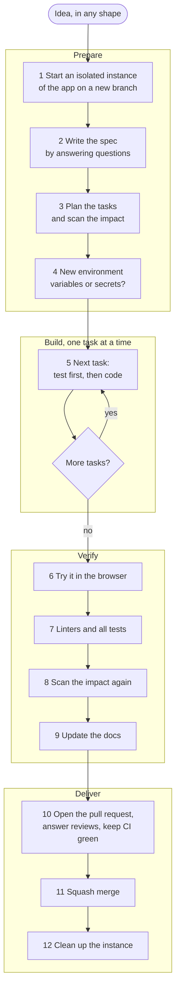
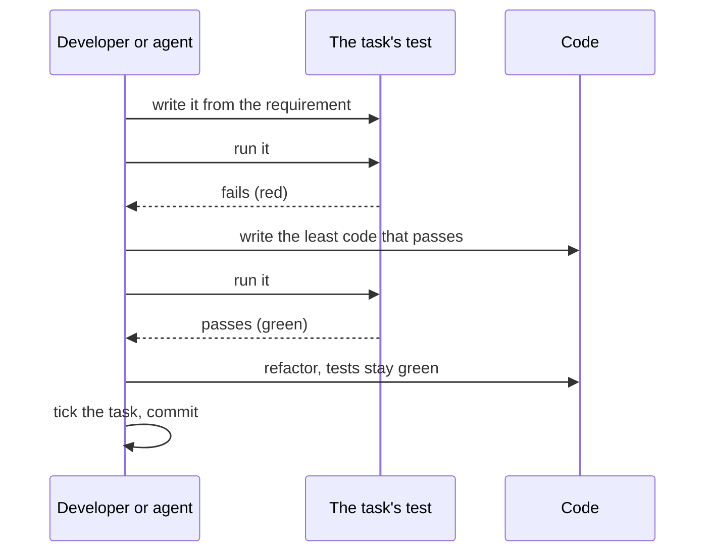

# Contributing

How a business feature gets from an idea to `main`. This is the
recommended way, not the only one: a technical change, such as swapping a
test library or bumping a tool, may skip the steps that do not fit. Why it
looks like this: [ADR 0029](docs/adr/0029-feature-workflow.md).

The steps are written for people. [Agent skills](.agents/skills/README.md)
carry them out for AI agents and follow this document; when the two
disagree, this document is right and the skill gets fixed.

## The workflow

### 1. Start an isolated instance

Each feature gets its own git worktree, branch, database and ports, so
several features run side by side with `main` without touching each other.
The apps run on your machine with Nx, not in Docker, to save resources;
PostgreSQL, Valkey and the admin panels are shared with the main checkout.
`pnpm instance up <branch>` does it; see
[Isolated instance of a branch](docs/development/setup.md#instances).

### 2. Write the spec

Turn the idea into `<feature>.spec.md` in the root of the worktree by
answering questions: who does what, what they see, what happens on errors,
what is out of scope. The file is not committed.

### 3. Plan the tasks and scan the impact

Split the spec into tasks in `<feature>.todo.md`, also not committed. Each
task makes sense on its own, names the files to read, and names its test.
Check which libraries the feature touches and what each of them requires
first, and whether it needs a new decision, which gets an ADR.

### 4. New environment variables or secrets

A new variable goes to `.env.example` with a safe local default. A secret
for the cluster goes to 1Password.

### 5. One task at a time, test first

A test that passes before the code exists tests nothing; fix the test. A
new user-facing feature starts with its `.feature` file. The rules for
tests are in [AGENTS.md](AGENTS.md#tests). Skipping test first is allowed
only on the developer's explicit word, written in the task as
`TDD: skipped — <reason>` and listed in the pull request.

### 6. Try it in the browser

Click through the scenarios of the spec in the running instance, including
the error paths. An agent does it in Chrome it controls and shows what it
saw.

### 7. Linters and all tests

The commands in [AGENTS.md](AGENTS.md#before-a-commit).

### 8. Scan the impact again

Compare the libraries the plan named with those the change really touched
(`nx affected`). Each surprise is either a missing task or a missing step in
the plan.

### 9. Update the docs

Every part of the spec ends where it lasts, and nothing is lost with the
working files:

| Part of the spec                      | Goes to                                                                 |
| ------------------------------------- | ----------------------------------------------------------------------- |
| user scenarios                        | `.feature` files in `apps/web-e2e/features`                             |
| domain rules and edge cases           | API tests, unit tests for domain rules                                  |
| shape of the API                      | DTOs and the generated contracts                                        |
| a new architectural decision          | an ADR in `docs/adr`                                                    |
| a change to the system's picture      | `docs/README.md`, see the table in [AGENTS.md](AGENTS.md#documentation) |
| how a mechanism works                 | the library's `README.md` or `docs/concepts`                            |
| new environment variables and secrets | `.env.example` and 1Password                                            |
| why, scope and what is out of scope   | the pull request description                                            |

### 10. Open the pull request

The title follows Conventional Commits, because it becomes the commit on
`main` ([ADR 0027](docs/adr/0027-squash-merges.md)). The description says
why and what is out of scope, lists tasks that skipped test first, and ends
with the whole spec in a folded `
` block. Answer reviews and keep
CI green until it is merged.

### 11–12. Merge and clean up

After the squash merge, `pnpm instance sweep` stops the instance and
removes its worktree, database and branch. `pnpm instance up` sweeps too,
so a forgotten instance goes when the next one starts.
