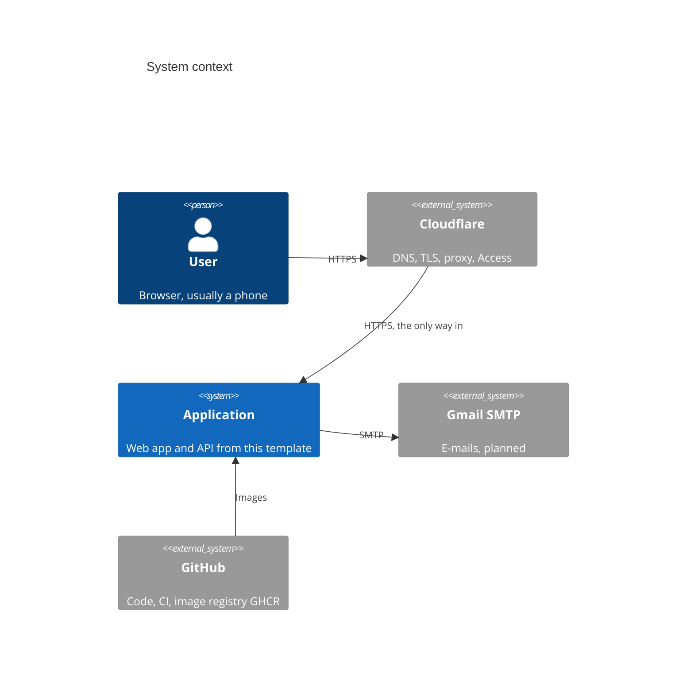
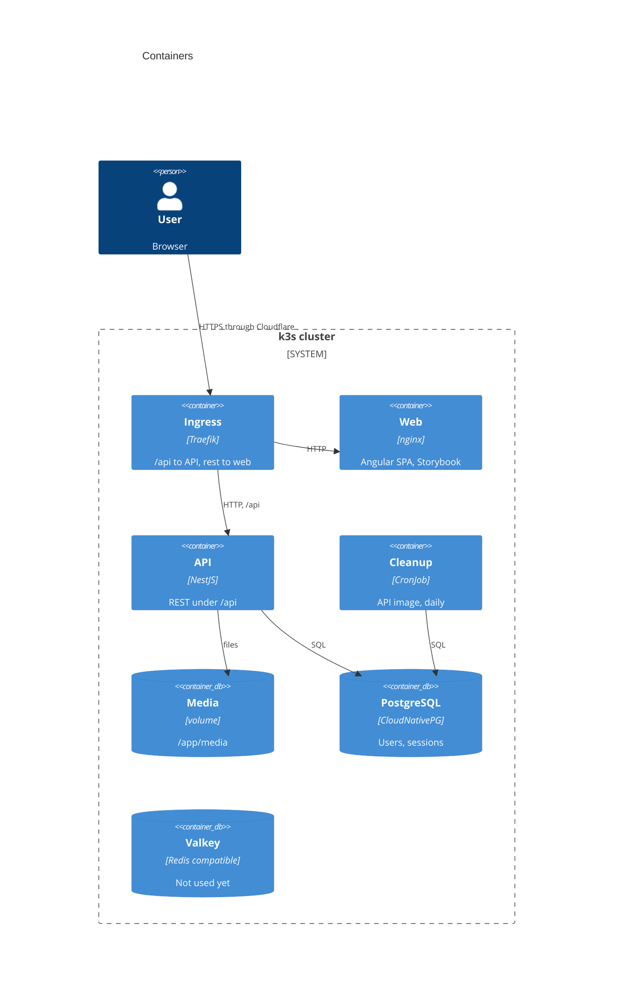

# Architecture

An overview in the shape of [arc42](https://arc42.org), with only the
sections that have content so far. Diagrams follow the
[C4 model](https://c4model.com) and are Mermaid, so GitHub shows them.

How these documents divide the work:

| Document                              | Answers                                        |
| ------------------------------------- | ---------------------------------------------- |
| this file                             | what the system is and how its parts fit       |
| [concepts](#8-cross-cutting-concepts) | how a mechanism that spans libraries works now |
| `README.md` of an app or library      | how that one place works                       |
| [ADRs](adr/README.md)                 | why a decision was made                        |
| `AGENTS.md` files                     | what code there must and must not do           |

## 1. Introduction and goals

A template for new web applications: fork it, rename it and build a product
on top. It ships the parts every app needs, such as login, an API contract,
a design system and CI, so a new app starts with its own domain.

Quality goals, in order:

1. **Consistency.** One way to do each thing, checked by tools, so people
   and AI agents find and write code the same way.
2. **Security.** Strict CSP, httpOnly cookies, rate limits, exact versions.
3. **Mobile first.** Every screen is designed for a phone first.
4. **Learning.** DDD, NestJS, Angular and spartan/ui as used at work.

## 3. Context



## 4. Solution strategy

| Concern        | Choice                                           | Why                                                                                 |
| -------------- | ------------------------------------------------ | ----------------------------------------------------------------------------------- |
| Repository     | Nx monorepo, logic in libraries                  | [ADR 0005](adr/0005-nx-monorepo-layout.md)                                          |
| Backend        | NestJS, strict DDD layers per domain             | [ADR 0015](adr/0015-ddd-layers.md)                                                  |
| Frontend       | Angular, spartan/ui, atomic design, Storybook    | [ADR 0002](adr/0002-angular-frontend.md), [0017](adr/0017-spartan-and-storybook.md) |
| API contract   | an envelope with codes from one catalog          | [ADR 0012](adr/0012-response-envelope.md)                                           |
| Authentication | JWT in httpOnly cookies, rotating refresh tokens | [ADR 0010](adr/0010-cookie-authentication.md)                                       |
| Versions       | exact versions of everything, checked            | [ADR 0004](adr/0004-exact-versions.md)                                              |
| Delivery       | CI checks everything, builds only changed images | [ADR 0019](adr/0019-ci-pipeline.md)                                                 |

## 5. Building blocks



### Code

| Code                                     | Place                                                                                                       |
| ---------------------------------------- | ----------------------------------------------------------------------------------------------------------- |
| Bootstrapping and wiring of the backend  | `apps/api`                                                                                                  |
| Bootstrapping and wiring of the frontend | `apps/web`                                                                                                  |
| Backend logic                            | `libs/api/<domain>`, one library per domain, in DDD layers, see [libs/api/AGENTS.md](../libs/api/AGENTS.md) |
| Access control for the backend           | `libs/api/access`, imported as `@boilerplate/api-access`                                                    |
| Response envelope for the backend        | `libs/api/responses`, imported as `@boilerplate/api-responses`                                              |
| Frontend pages                           | `libs/web/<feature>`, for example `libs/web/auth`                                                           |
| Presentational components                | `libs/web/ui`, see [frontend](concepts/frontend.md)                                                         |
| API types for the frontend, generated    | `libs/shared/contracts`, imported as `@boilerplate/contracts`                                               |

- Apps stay thin. Logic lives in libraries, because Nx checks the allowed
  dependencies (`@nx/enforce-module-boundaries`) between projects, not between
  folders inside one project.
- Create a library with an Nx generator, for example
  `pnpm nx g @nx/nest:library libs/api/orders`.

## 7. Deployment

### Images

Each app has one Dockerfile with separate stages. Docker Compose uses the
`dev` stage, the cluster gets the `prod` stage. Both start from the same
dependency stage, so Node.js and the lockfile are the same in both.

```sh
scripts/test-prod-images.sh   # builds both prod images and checks them
```

- `prod` images are based on Alpine and run without root. They contain only
  the built code and runtime dependencies, no watchers or dev tools.
- The image does not set the log level. `LOG_LEVEL` comes from Compose
  (`debug`) or from the cluster manifest (`info`).
- Security headers: nginx sends a strict Content Security Policy and other
  headers for the web app, see [apps/web/README.md](../apps/web/README.md#security-headers).
  The API sends the `helmet` defaults.
- The web image is nginx with static files. It does not proxy `/api`,
  because in the cluster the ingress sends `/api` to the API and everything
  else to the web app, under one domain.
- Only the API mounts the media volume at `/app/media` and serves its files
  under `/api/media/`. The API does not start when the directory is not
  writable, because that is a configuration error a restart will not fix.

#### Health checks

| Path                | Probe     | Checks                                  |
| ------------------- | --------- | --------------------------------------- |
| `/api/health/live`  | liveness  | only that the process answers           |
| `/api/health/ready` | readiness | database and a writable media directory |

- Liveness never checks dependencies. A failed liveness probe restarts the
  pod, and when the database is down that restarts every pod without fixing
  anything.
- A failed readiness probe only stops traffic to the pod. Optional services,
  such as feature flags or error tracking, are reported as `degraded`, which
  keeps the answer at 200.
- Logs are not checked. The app writes them to stdout and the cluster
  collects them.

### CI

GitHub Actions, [`.github/workflows/ci.yml`](../.github/workflows/ci.yml). Every
run checks the whole repository with the same commands as before a commit.
On `main` it then builds, tests and pushes only the images of apps that
changed since the last successful run, to
`ghcr.io/zniszcz/boilerplate-angular-nest/<app>` with the tags `latest` and
the commit SHA. Why: [ADR 0019](adr/0019-ci-pipeline.md).

```sh
NX_BASE=HEAD~3 node scripts/changed-images.mjs   # which images would build
scripts/test-prod-images.sh web                  # test one image
```

## 8. Cross-cutting concepts

Mechanisms that span several libraries:

- [Authentication](concepts/authentication.md): login, refresh, rotation.
- [API contracts](concepts/api-contracts.md): the envelope, codes, DTOs to
  types.
- [Frontend](concepts/frontend.md): atomic design, loading, motion.

Topics of one place live next to their code:

- [Database and migrations](../apps/api/README.md#database)
- [Translations](../libs/web/i18n/README.md)
- [Security headers and Storybook in the web image](../apps/web/README.md)
- [spartan/ui atoms](../libs/web/helm/README.md)
- [Storybook](../apps/storybook/README.md)

Working on the code: [local setup](development/setup.md) and
[conventions](development/conventions.md).

## 9. Architecture decisions

[docs/adr](adr/README.md), one record per decision. This layout itself:
[ADR 0020](adr/0020-documentation-layout.md).
