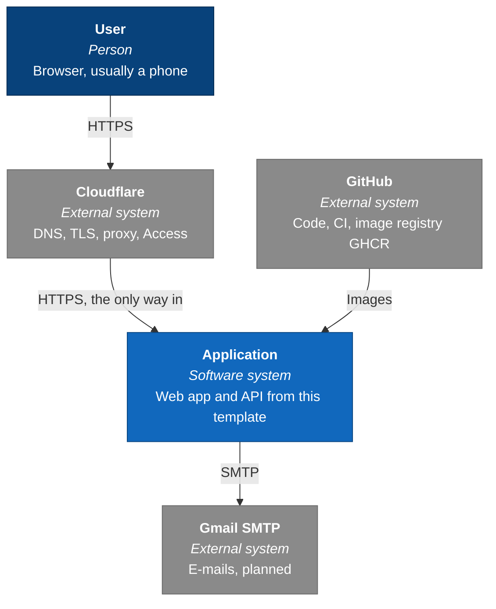
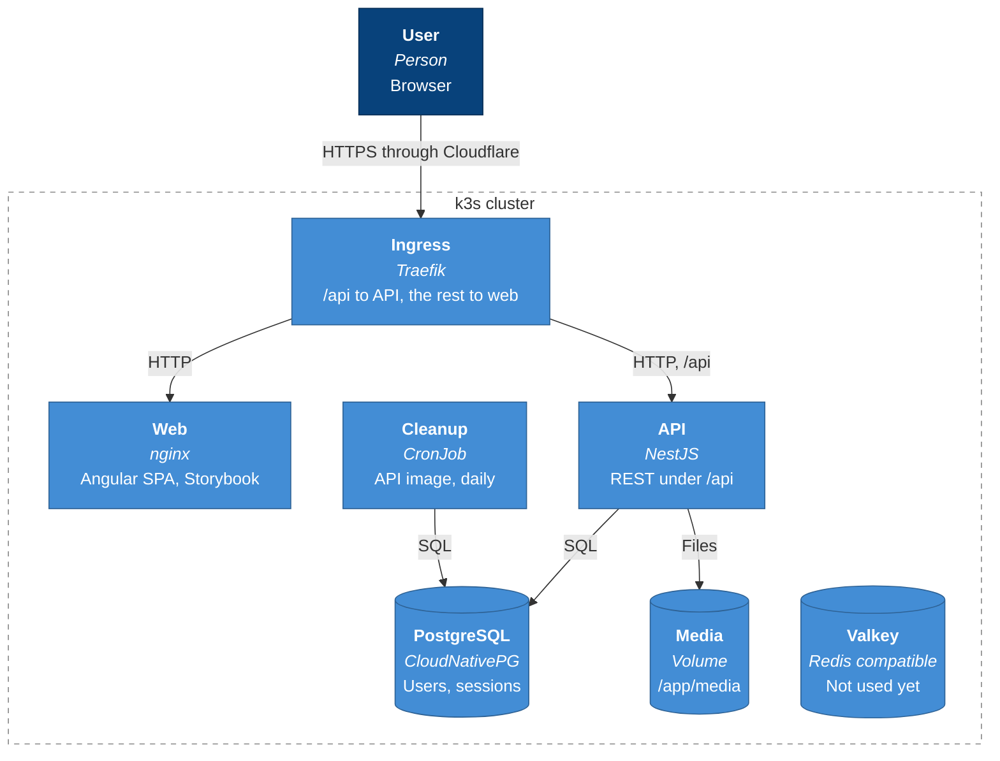

# Architecture

An overview in the shape of [arc42](https://arc42.org), with only the
sections that have content so far. Diagrams follow the
[C4 model](https://c4model.com) and are Mermaid, so GitHub shows them. They
are flowcharts in the C4 colours, not Mermaid's experimental C4 syntax, whose
layout changes between Mermaid versions and tangles the arrows.

How these documents divide the work:

| Document                              | Answers                                        |
| ------------------------------------- | ---------------------------------------------- |
| this file                             | what the system is and how its parts fit       |
| [concepts](#8-cross-cutting-concepts) | how a mechanism that spans libraries works now |
| `README.md` of an app or library      | how that one place works                       |
| [ADRs](adr/README.md)                 | why a decision was made                        |
| `AGENTS.md` files                     | what code there must and must not do           |

## 1. Introduction and goals

A template for new web applications: fork it, rename it and build a product
on top. It ships the parts every app needs, such as login, an API contract,
a design system and CI, so a new app starts with its own domain.

Quality goals, in order:

1. **Consistency.** One way to do each thing, checked by tools, so people
   and AI agents find and write code the same way.
2. **Security.** Strict CSP, httpOnly cookies, rate limits, exact versions.
3. **Mobile first.** Every screen is designed for a phone first.
4. **Learning.** DDD, NestJS, Angular and spartan/ui as used at work.

## 3. Context

### Context diagram (C4 level 1)



## 4. Solution strategy

| Concern        | Choice                                           | Why                                                                                 |
| -------------- | ------------------------------------------------ | ----------------------------------------------------------------------------------- |
| Repository     | Nx monorepo, logic in libraries                  | [ADR 0005](adr/0005-nx-monorepo-layout.md)                                          |
| Backend        | NestJS, strict DDD layers per domain             | [ADR 0015](adr/0015-ddd-layers.md)                                                  |
| Frontend       | Angular, spartan/ui, atomic design, Storybook    | [ADR 0002](adr/0002-angular-frontend.md), [0017](adr/0017-spartan-and-storybook.md) |
| API contract   | an envelope with codes from one catalog          | [ADR 0012](adr/0012-response-envelope.md)                                           |
| Authentication | JWT in httpOnly cookies, rotating refresh tokens | [ADR 0010](adr/0010-cookie-authentication.md)                                       |
| Versions       | exact versions of everything, checked            | [ADR 0004](adr/0004-exact-versions.md)                                              |
| Delivery       | CI checks everything, builds only changed images | [ADR 0019](adr/0019-ci-pipeline.md)                                                 |

## 5. Building blocks

### Container diagram (C4 level 2)



### Code

Every app and library, with the first paragraph of its README. Generated
from the repository by `pnpm docs:generate`; edit the README, not this table.

<!-- generated:projects -->

| Project                                                         | Tags                            | What it is                                                                                                                                                                                           |
| --------------------------------------------------------------- | ------------------------------- | ---------------------------------------------------------------------------------------------------------------------------------------------------------------------------------------------------- |
| [apps/api](../apps/api/README.md)                               | `scope:api` `type:app`          | The NestJS API, which only wires the modules from `libs/api` together.                                                                                                                               |
| [apps/storybook](../apps/storybook/README.md)                   | `scope:web` `type:app`          | Storybook for the web UI, opening every story at phone width.                                                                                                                                        |
| [apps/web-e2e](../apps/web-e2e/README.md)                       | `scope:web` `type:e2e`          | End-to-end scenarios in English `.feature` files, run by Playwright through playwright-bdd on the built apps.                                                                                        |
| [apps/web](../apps/web/README.md)                               | `scope:web` `type:app`          | The Angular app, served in production by nginx with strict security headers.                                                                                                                         |
| [libs/api/access](../libs/api/access/README.md)                 | `scope:api` `type:platform`     | Technical access control for the backend, shared by every domain: the global guard, `@Public()`, `@RequirePermissions()`, `@CurrentUser()`, JWT access tokens, cookie settings and password hashing. |
| [libs/api/authentication](../libs/api/authentication/README.md) | `scope:api` `type:domain`       | The authentication domain: login, refresh and logout, with the Session aggregate and its refresh token rotation rules.                                                                               |
| [libs/api/responses](../libs/api/responses/README.md)           | `scope:api` `type:platform`     | The response envelope for the backend: coded exceptions, the Swagger decorator for errors and the marker for routes without an envelope.                                                             |
| [libs/api/users](../libs/api/users/README.md)                   | `scope:api` `type:domain`       | The users domain: the User aggregate with its permissions.                                                                                                                                           |
| [libs/shared/contracts](../libs/shared/contracts/README.md)     | `scope:shared` `type:contracts` | Types shared by the web app and the API: the generated API types and the catalog of response codes with the envelope.                                                                                |
| [libs/web/account](../libs/web/account/README.md)               | `scope:web` `type:feature`      | The logged in user's account page: deleting the account with the current password.                                                                                                                   |
| [libs/web/auth](../libs/web/auth/README.md)                     | `scope:web` `type:feature`      | Login on the web side: the login page, `AuthStore` with the logged in user, route guards and the interceptor that refreshes the session.                                                             |
| [libs/web/errors](../libs/web/errors/README.md)                 | `scope:web` `type:feature`      | Error pages, such as the page for an unknown address.                                                                                                                                                |
| [libs/web/helm](../libs/web/helm/README.md)                     | `scope:web` `type:ui`           | The styled layer of spartan/ui: Tailwind components on top of the headless `@spartan-ng/brain`.                                                                                                      |
| [libs/web/home](../libs/web/home/README.md)                     | `scope:web` `type:feature`      | The start page for a logged in user: a summary of the account.                                                                                                                                       |
| [libs/web/i18n](../libs/web/i18n/README.md)                     | `scope:web` `type:feature`      | Transloco setup and the language switcher.                                                                                                                                                           |
| [libs/web/shell](../libs/web/shell/README.md)                   | `scope:web` `type:feature`      | Parts of the app frame that need state: the navigation, which links to the pages the logged in user may open.                                                                                        |
| [libs/web/ui](../libs/web/ui/README.md)                         | `scope:web` `type:ui`           | Molecules, organisms and templates built from the spartan/ui atoms in `libs/web/helm`, each with a story.                                                                                            |
| [libs/web/users](../libs/web/users/README.md)                   | `scope:web` `type:feature`      | The users page: with `users:read` the list of users, marked active once they logged in, and with `users:create` the form that adds one and shows its generated password once.                        |

<!-- /generated:projects -->

- Apps stay thin. Logic lives in libraries, because Nx checks the allowed
  dependencies (`@nx/enforce-module-boundaries`) between projects, not between
  folders inside one project.
- Create a library with an Nx generator, for example
  `pnpm nx g @nx/nest:library libs/api/orders`.

## 7. Deployment

### Images

Each app has one Dockerfile with separate stages. Docker Compose uses the
`dev` stage, the cluster gets the `prod` stage. Both start from the same
dependency stage, so Node.js and the lockfile are the same in both.

```sh
scripts/test-prod-images.sh   # builds both prod images and checks them
```

- `prod` images are based on Alpine and run without root. They contain only
  the built code and runtime dependencies, no watchers or dev tools.
- The image does not set the log level. `LOG_LEVEL` comes from Compose
  (`debug`) or from the cluster manifest (`info`).
- Security headers: nginx sends a strict Content Security Policy and other
  headers for the web app, see [apps/web/README.md](../apps/web/README.md#security-headers).
  The API sends the `helmet` defaults.
- The web image is nginx with static files. It does not proxy `/api`,
  because in the cluster the ingress sends `/api` to the API and everything
  else to the web app, under one domain.
- Only the API mounts the media volume at `/app/media` and serves its files
  under `/api/media/`. The API does not start when the directory is not
  writable, because that is a configuration error a restart will not fix.

#### Health checks

| Path                | Probe     | Checks                                  |
| ------------------- | --------- | --------------------------------------- |
| `/api/health/live`  | liveness  | only that the process answers           |
| `/api/health/ready` | readiness | database and a writable media directory |

- Liveness never checks dependencies. A failed liveness probe restarts the
  pod, and when the database is down that restarts every pod without fixing
  anything.
- A failed readiness probe only stops traffic to the pod. Optional services,
  such as feature flags or error tracking, are reported as `degraded`, which
  keeps the answer at 200.
- Logs are not checked. The app writes them to stdout and the cluster
  collects them.

### CI

GitHub Actions. The checks of the whole repository, the same commands as
before a commit, are in [`checks.yml`](../.github/workflows/checks.yml) and
run twice: **Check the branch alone** ([`ci.yml`](../.github/workflows/ci.yml)) on
every push to a branch, and **Check the branch works when merged into main**
([`merge.yml`](../.github/workflows/merge.yml)) on a pull request, against
the branch merged with the current `main`. Both skip a push that changes
only Markdown; **Check the docs alone**
([`docs.yml`](../.github/workflows/docs.yml)) checks such a push: its
formatting, the generated lists and the agent skills. Each run ends with a
short summary on its page. On `main`, **Check the branch alone** then builds, tests and pushes only the images of apps that
changed since the last successful run, to
`ghcr.io/zniszcz/boilerplate-angular-nest/<app>` with the tags `latest` and
the commit SHA, keeping the 10 newest versions and any tagged `prod`. Why:
[ADR 0019](adr/0019-ci-pipeline.md), [ADR 0026](adr/0026-image-retention.md),
[ADR 0024](adr/0024-ci-on-every-branch.md) and
[ADR 0025](adr/0025-ci-jobs-and-caches.md).

```sh
NX_BASE=HEAD~3 node scripts/changed-images.mjs   # which images would build
scripts/test-prod-images.sh web                  # test one image
```

## 8. Cross-cutting concepts

Mechanisms that span several libraries, generated from `docs/concepts`:

<!-- generated:concepts -->

- [API contracts](concepts/api-contracts.md): How the backend and the web app agree on every request and response.
- [Authentication](concepts/authentication.md): How login, refresh and logout work across three libraries.
- [Frontend](concepts/frontend.md): How the web app is put together, from spartan/ui atoms to pages, and how it loads and moves.
- [Testing](concepts/testing.md): How the tests run: backend tests against a real database, frontend logic in Angular's test environment.

<!-- /generated:concepts -->

Topics of one app or library are in its README, listed under
[Code](#code).

Working on the code: [local setup](development/setup.md),
[conventions](development/conventions.md), the
[impact of each project](development/impact.md),
[adding an app](development/adding-an-app.md) and the
[feature workflow](../CONTRIBUTING.md), which
[agent skills](../.agents/skills/README.md) carry out.

## 9. Architecture decisions

[docs/adr](adr/README.md), one record per decision. This layout itself:
[ADR 0020](adr/0020-documentation-layout.md).
