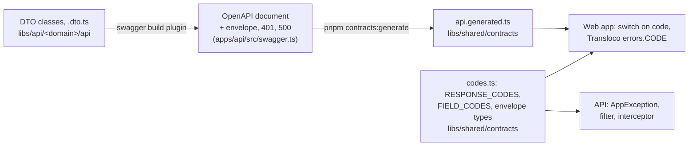

# API contracts

How the backend and the web app agree on every request and response. Why:
[ADR 0012](../adr/0012-response-envelope.md) (envelope and codes) and
[ADR 0013](../adr/0013-own-field-codes-and-no-backend-i18n.md) (field codes).



## The envelope

Every response the web app sees, apart from files and health probes, is
wrapped:

```ts
{ status: 'success', code: 'OK', data: { ... } }
{ status: 'error', code: 'AUTH_TOO_MANY_ATTEMPTS', params: { retryAfter: 900 } }
{ status: 'error', code: 'VALIDATION_ERROR',
  details: [{ field: 'email', code: 'INVALID_EMAIL' }] }
```

| Piece                                                     | Where                                                  |
| --------------------------------------------------------- | ------------------------------------------------------ |
| codes and envelope types                                  | `libs/shared/contracts/src/lib/codes.ts`               |
| `AppException`, `@ApiError`, `@NoEnvelope()`, field codes | `libs/api/responses`                                   |
| wrapping success                                          | `apps/api/src/responses/envelope.interceptor.ts`       |
| wrapping every error                                      | `apps/api/src/responses/envelope-exception.filter.ts`  |
| texts for codes                                           | `apps/web/public/i18n/<language>.json`, under `errors` |

## From DTO to types

Backend DTO classes (`*.dto.ts`) are the single source of truth for the API:

1. `class-validator` decorators on DTOs validate incoming data. Fields the DTO
   does not declare are rejected.
2. The `@nestjs/swagger` build plugin turns DTOs and their doc comments into
   the OpenAPI document, without describing fields by hand.
3. `pnpm contracts:generate` writes TypeScript types from that document to
   `libs/shared/contracts`, and the frontend imports them from
   `@boilerplate/contracts`.

- Entities never go to the API directly. A service copies an entity to a DTO
  field by field, so a field that is not copied, such as a password hash,
  never leaves the backend.
- Run `pnpm contracts:generate` after changing a DTO or a route, and commit
  the generated file. CI will run `pnpm contracts:check`.

## Compatibility

The web app and the API deploy together, so they always match. The only gap
is a browser that still has the old web app open after a deployment.

- The API has no version in the path (`/api/v1`). NestJS versioning will be
  turned on when there is an outside client, such as a mobile app.
- Changes stay backward compatible: add fields at once, remove or rename them
  only in a later deployment.
