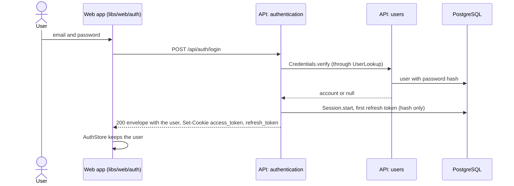
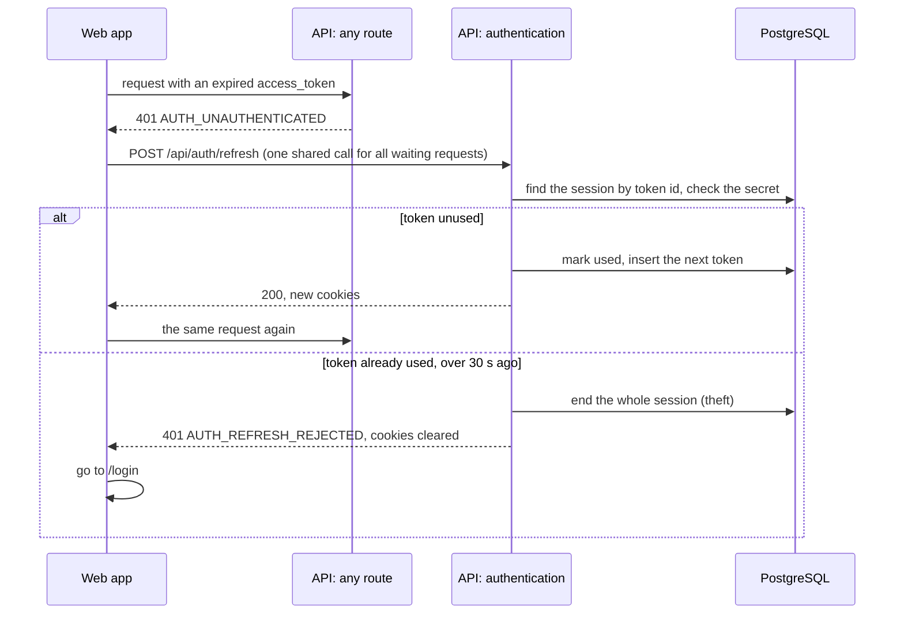

# Authentication

How login, refresh and logout work across three libraries. Why it is built
this way: [ADR 0010](../adr/0010-cookie-authentication.md) (cookies and
rotation) and [ADR 0011](../adr/0011-login-rate-limit.md) (rate limit).

| Library                   | Does                                                              |
| ------------------------- | ----------------------------------------------------------------- |
| `libs/api/access`         | the global guard, `@Public()`, permissions, JWT, cookie settings  |
| `libs/api/authentication` | login, refresh and logout; the Session aggregate and its rotation |
| `libs/api/users`          | users and their passwords, reached only through `UserLookup`      |
| `libs/web/auth`           | `AuthStore`, route guards and the interceptor that refreshes      |

## Login

## Refresh with rotation

## Details

- Two tokens, both in httpOnly cookies:
  - the access token, a JWT valid for 15 minutes, sent with every request to
    `/api`. Checking it needs no database, so the API stays stateless for
    almost every request;
  - the refresh token, valid for 30 days, sent only to `/api/auth`. It is
    stored hashed in `refresh_tokens`, so a session can be ended.
- `POST /api/auth/login` sets both cookies and returns the user.
  `POST /api/auth/refresh` exchanges the refresh token for new tokens and
  reads permissions from the database again. `POST /api/auth/logout` ends the
  session and removes both cookies.
- Rotation: every refresh token can be used once. Using an exchanged token
  again means it was stolen, so the whole session (token family) is revoked.
  A reuse within 30 seconds is two tabs refreshing at once and is only
  refused.
- Cleanup: the `cleanup` command (`node cleanup.js` in the image) removes
  expired tokens and tokens of sessions that ended over 7 days ago. It runs
  once a day from a scheduler, which belongs to the deployment, so the app
  does not depend on Kubernetes.
- The web app refreshes on its own: `AUTH_UNAUTHENTICATED` triggers one shared refresh, then
  the request is repeated. When that fails, the user goes to `/login`.
- Tokens are never in a response body. The cookies are `HttpOnly`, so page
  scripts cannot read them and an XSS attack cannot steal them, and
  `SameSite=Strict`, so other sites cannot send them, which blocks CSRF. This
  works because the web app and the API share one domain.
- The cookies are `Secure` when `NODE_ENV=production`, which the prod image
  sets. Locally there is no HTTPS, so it is not.
- Clients that are not browsers can send the access token in an
  `Authorization: Bearer` header instead.
- Every route needs a token. Mark open routes with `@Public()`.
- `@RequirePermissions('users:read')` allows a route only to users with that
  permission. Permissions travel in the access token, so a change takes
  effect at the next refresh, at most after 15 minutes.
- Add new permissions in `libs/api/users/src/lib/domain/user/permissions.ts`. The seed
  command writes them to the database.
- Passwords are hashed with scrypt, built into Node.js.
- The password hash column has `select: false`, so ordinary queries never load
  it. Only the login query asks for it.
