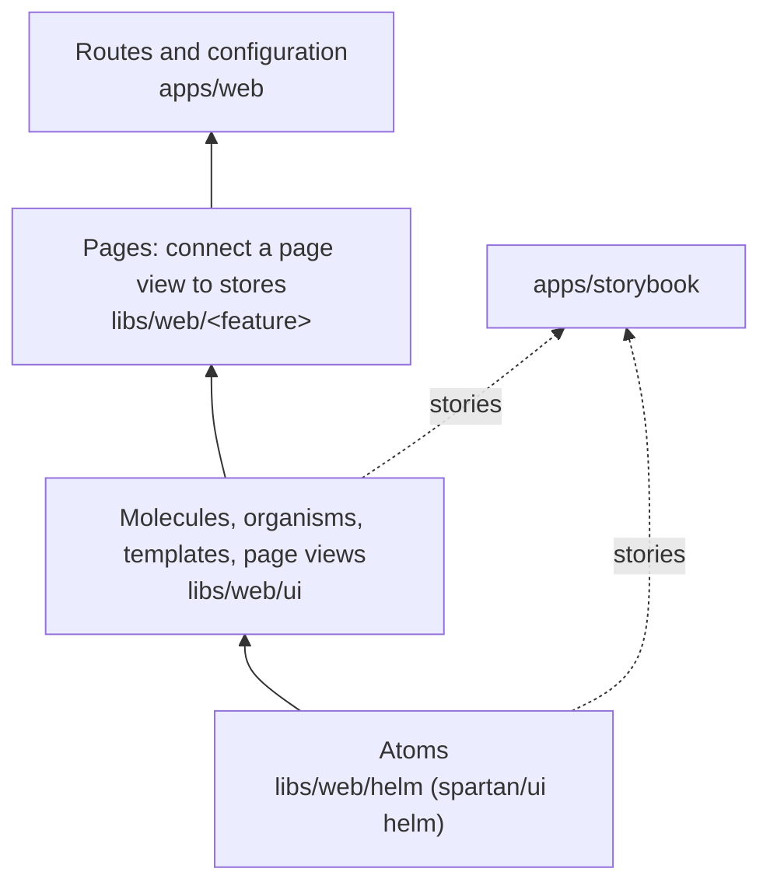

# Frontend

How the web app is put together, from spartan/ui atoms to pages, and how it
loads and moves. Why: [ADR 0017](../adr/0017-spartan-and-storybook.md)
(spartan/ui, Storybook) and [ADR 0018](../adr/0018-loading-states-and-motion.md)
(loading, motion).

## Loading

| What waits            | Tool                                         | Looks like                  |
| --------------------- | -------------------------------------------- | --------------------------- |
| a page's code         | lazy route, preloaded in the background      | nothing                     |
| a part below the fold | `@defer (on viewport)`                       | the part's skeleton         |
| data                  | `httpResource` in a store, `snapshot()` down | the organism's skeleton     |
| an action             | `pending` input                              | a spinner inside the button |

## Structure and rules

Components follow atomic design, from spartan/ui atoms up to pages that only
place blocks. Code goes by what it does:

| Place                | Contains                                                                                                                                                                                                                                                       |
| -------------------- | -------------------------------------------------------------------------------------------------------------------------------------------------------------------------------------------------------------------------------------------------------------- |
| `libs/web/helm`      | Atoms: spartan/ui helm components, generated by the spartan CLI, see [libs/web/helm/AGENTS.md](../../libs/web/helm/AGENTS.md)                                                                                                                                  |
| `libs/web/ui`        | Molecules, organisms, templates and page views built from the atoms. A page view is a whole screen, shown in Storybook under `Pages/`. Data comes in through inputs, events go out through outputs. No store, HTTP or router. Texts may use the transloco pipe |
| `libs/web/<feature>` | Pages, one per screen, such as `libs/web/home`, `libs/web/users` and `libs/web/account`. Each connects its page view to stores and has no look of its own                                                                                                      |
| `libs/web/i18n`      | Transloco setup and the language switcher                                                                                                                                                                                                                      |
| `libs/web/errors`    | Error pages, such as the 404 page for unknown addresses                                                                                                                                                                                                        |
| `libs/web/shell`     | Parts of the app frame that need state, such as the navigation                                                                                                                                                                                                 |
| `apps/web`           | Configuration, routes and an empty root component that only composes                                                                                                                                                                                           |
| `apps/storybook`     | Storybook collecting the stories next to the components, see [apps/storybook/README.md](../../apps/storybook/README.md)                                                                                                                                        |

- Styling is Tailwind 4, utility classes in templates. It is mobile first:
  plain classes are for phones, `sm:` and `md:` add to bigger screens.
  Colors come from the spartan/ui theme variables in `apps/web/src/styles.css`
  through tokens such as `bg-card`. Why: [ADR 0017](../adr/0017-spartan-and-storybook.md).
  `apps/web/src/styles.css` is plain CSS, because Tailwind does not work
  through Sass, and it reads classes from `libs/web`.
- Loading and motion follow one system: lazy pages, `@defer` below the first
  screen, `httpResource` for data, skeletons of the same size as the content
  and a small catalog of motion classes. See
  [ADR 0018](../adr/0018-loading-states-and-motion.md).
- State lives in NgRx Signal Store. `AuthStore` in `libs/web/auth` keeps the
  logged in user. It asks `/api/users/me` once when the app starts, so route
  guards know the answer.
- The app calls the API with Angular `HttpClient` and relative paths, such as
  `/api/users/me`, typed with `@boilerplate/contracts`.
- The dev server passes `/api` to the API (`apps/web/proxy.conf.mjs`), so
  locally the app uses one address, like in the cluster. `API_PROXY_TARGET`
  points it elsewhere; Docker Compose points it at the `api` container.
- No `subscribe()` whose subscription is dropped, because it never ends and
  leaks memory. Use `toSignal`, the `async` pipe or `takeUntilDestroyed()`.
  ESLint checks it with `rxjs-x/no-ignored-subscription`.
