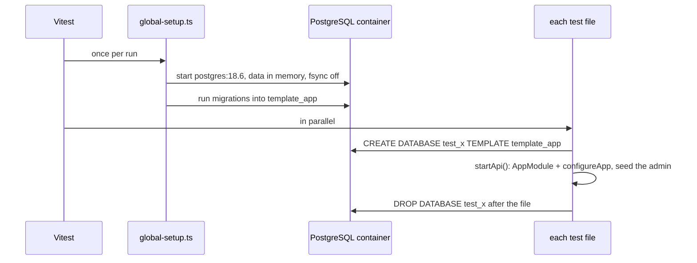
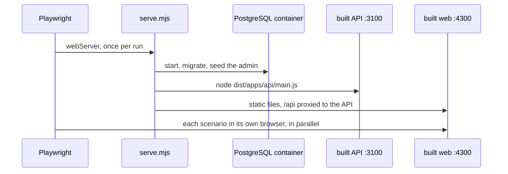

# Testing

How the tests run: backend tests against a real database, frontend logic in
Angular's test environment. What to test and why:
[ADR 0021](../adr/0021-testing-strategy.md); mutation testing:
[ADR 0022](../adr/0022-mutation-testing.md).

| Where                         | What                                                                                               | Config                                                                |
| ----------------------------- | -------------------------------------------------------------------------------------------------- | --------------------------------------------------------------------- |
| `libs/api/*/src/**/*.spec.ts` | unit tests of domain rules, no Nest and no database                                                | `vitest.config.mts` per lib                                           |
| `libs/web/*/src/**/*.spec.ts` | unit tests of frontend logic, such as the refresh interceptor, in jsdom with TestBed; no templates | `vitest.config.mts` per lib, setup in `tools/vitest/angular-setup.ts` |
| `apps/api/test/*.spec.ts`     | API tests: the whole app over HTTP on PostgreSQL                                                   | `apps/api/vitest.config.mts`                                          |
| root                          | all backend tests at once, for Stryker only                                                        | `vitest.mutation.config.mts`                                          |

`pnpm test` runs every project's tests through Nx; `pnpm mutate` runs
Stryker.

## One container, a database per test file

- Copying the template takes milliseconds, so files run in parallel and never
  see each other's data. Tests inside one file share their database.
- `configureApp` is the same function `main.ts` uses, so tests get the same
  pipes, envelope and cookies as clients do.
- Each `browser()` in `test/api.ts` has its own cookies and its own
  `CF-Connecting-IP`, so the login rate limit of one test never blocks
  another.
- Webpack's `require.context` does not exist in Vitest; `test/migrations.ts`
  finds the same migration files with `import.meta.glob`.
- Nest needs decorator metadata, so the API tests compile with SWC.

## Races

Two requests that should collide rarely do on a fast machine. The refresh
race test holds a row lock on the tokens, waits in `pg_stat_activity` until
both requests wait for it, and then releases it. The race then happens every
time, not by luck.

## End-to-end scenarios

- `bddgen` turns `features/*.feature` into Playwright tests in
  `.features-gen/`, which is not committed.
- `steps/fixtures.ts` gives every scenario its own users (`accounts`), its
  own client address and an admin API client to set up what a scenario
  takes as given.
- Reports go to `reports/e2e` (HTML in `html/`, `results.json` for the CI
  summary), traces of failed retries to `tmp/e2e-results`. In CI both are
  uploaded as the `e2e-report` artifact when a scenario fails.

## Mutation testing in CI

| Run                               | Mutants checked            | Results cache                               |
| --------------------------------- | -------------------------- | ------------------------------------------- |
| `pnpm mutate` locally, `pre-push` | only those in changed code | `reports/mutation/`, not shared             |
| Branch checks, push to any branch | only those in changed code | the branch's own, else `main`'s; then saved |
| Merge with main, pull request     | only those in changed code | `main`'s, not saved                         |
| `mutation-nightly.yml`, 02:00 UTC | all (`--force`)            | saved fresh                                 |

The nightly run is started by GitHub's scheduler, from the workflow file on
`main`, and runs on GitHub's machines. Things to know:

- **Start time is approximate.** Under load GitHub delays scheduled runs,
  sometimes by tens of minutes.
- **It stops after 60 days without activity** in a public repository. GitHub
  disables the schedule; turn it on again in the Actions tab, on the
  workflow's page.
- **In a fork it is off** until someone enables workflows there. After
  forking, open the Actions tab and enable them, or the nightly run never
  happens and CI keeps reusing old results.
- **Run it by hand** from the Actions tab (`workflow_dispatch`) after a change
  that tests do not touch directly, such as a dependency upgrade.
